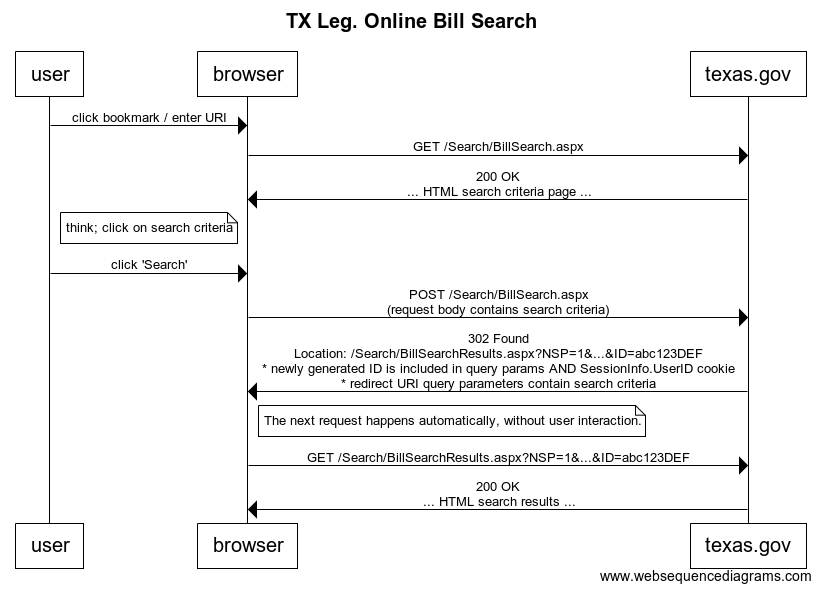

A thin, incomplete Python library wrapper around the [Texas Legislature Online
Bill Search](https://capitol.texas.gov/Search/BillSearch.aspx).

## Install and Test

```bash
$ pip install --user pipenv
...
$ cd TxBillSearch
...
$ pipenv install
... installs Requests and BeatifulSoup 4 ...
$ pipenv shell
(TxLegOnlineScraper3-_s_xUwQa) $ python txbillsearch.py
HB 21
HB 22
...
HB 45
(TxLegOnlineScraper3-_s_xUwQa) $ exit # from the pipenv environment
$
```

## Module Usage

The `if __name__ == '__main__':` block at the end of
[txbillsearch.py](txbillsearch.py) gives a notion of how to use this module.
The most useful exposed function is `new_search_id()`. Use a [Requests
Session](http://docs.python-requests.org/en/master/user/advanced/#session-objects)
to simplify cookie handling and connection management.

```python
if __name__ == '__main__':
    session = requests.Session()
    id = new_search_id(session)     # <== THE IMPORTANT PART!
    # Substitute this "fresh" ID for the one included in old searches.

    # This is just a very simple demonstration that we can actually get 
    # search results directly from BillSearchResults.aspx.
    for bill in matching_bill_names(session, BILL_SEARCH_RESULT_URI, id):
        print(bill)
```

## Technical Details

For some reason,
[BillSearchResults.aspx](https://capitol.texas.gov/Search/BillSearchResults.aspx)
requires that you supply an ID, generated on
[BillSearch.aspx](https://capitol.texas.gov/Search/BillSearch.aspx). This ID
must be "fresh"; that is it must have been generated less than 24-ish hours ago
(I don't know the exact time interval). Without a "fresh" ID,
BillSearchResults.aspx displays "No bills were found matching the entered
search criteria." or redirects the client back to BillSearch.aspx.


This ID is generated during the ASP.NET
POSTback that occurs to BillSearch.aspx after you have selected your search
criteria, but before you are redirected to BillSearchResults.aspx:



## Disclaimer

I made my best effort to read through the Texas Legislature Online Terms and
Conditions, and found nothing that prohibited automated/programmatic use or
access of this information. If there's a better way to do this (e.g., a *real*
web service) I'd love to know about it, and would much prefer to use it to the
wasteful and inconvenient method developed herein.
